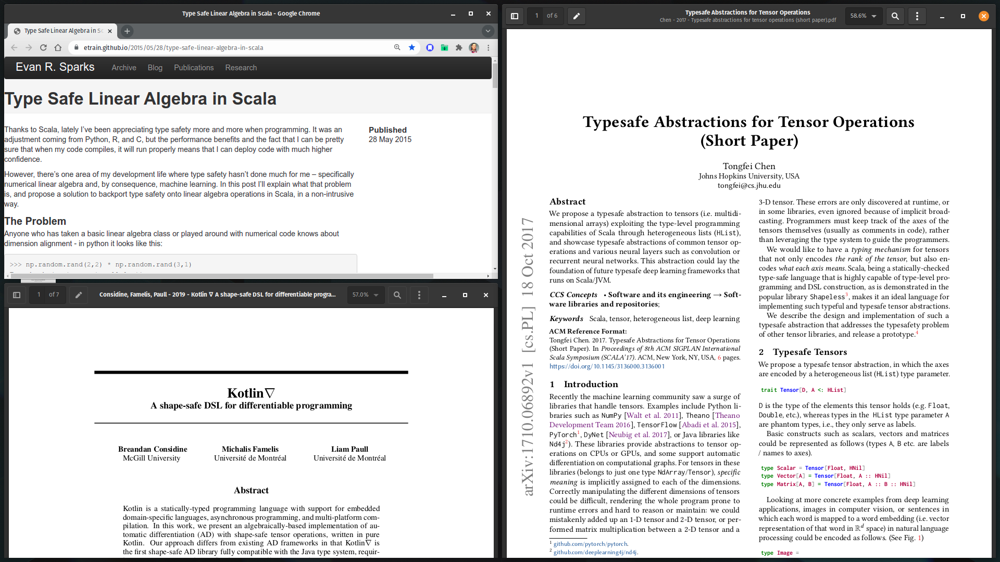
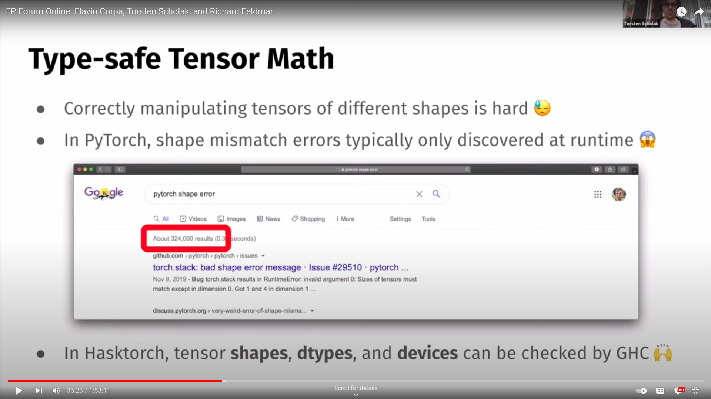
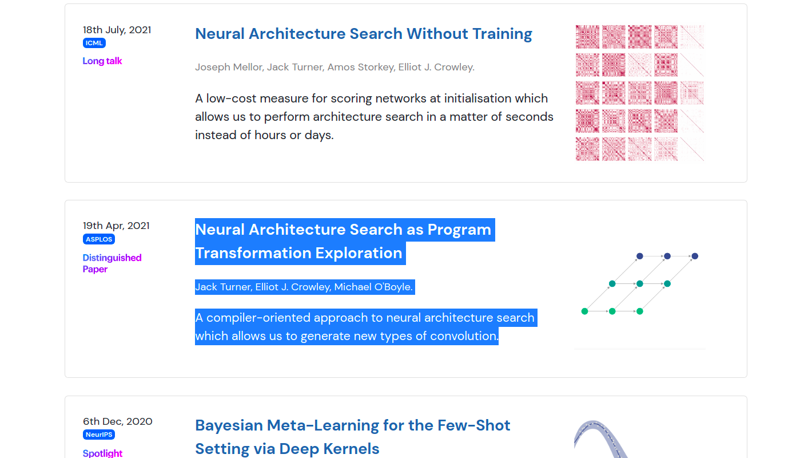
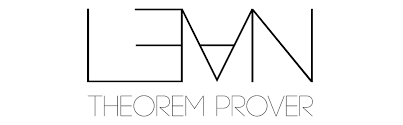
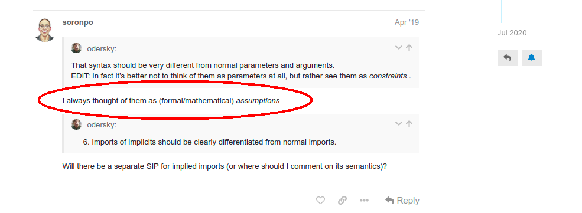
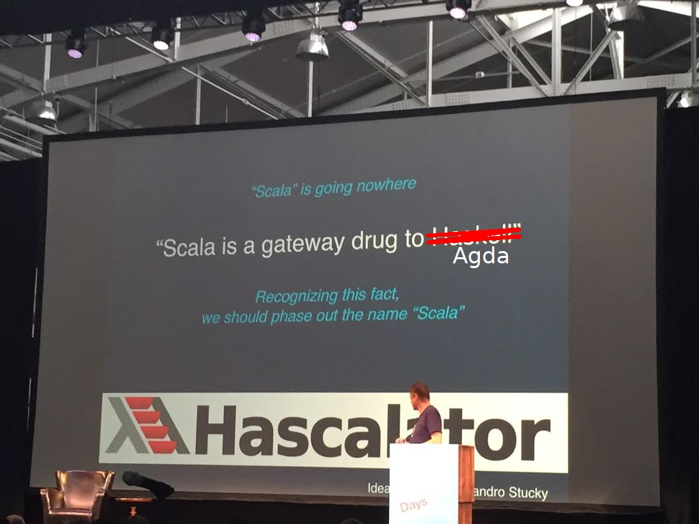

# Shape Safety in Tensor Programming is Easy for a Theorem Prover

### Project: https://github.com/tribbloid/shapesafe
### Content: https://github.com/tribbloid/shapesafe-demo


#### -- **Peng Cheng** - tribbloid@{github | twitter}

---


# **About Me** 

#### Maintainer of DataPassports, Computing Engine ... *2015 ~*

- Only read Scala 'cause of Apache Spark
- Only read type theory 'cause math seems more stable than programming
- Not a Python fan, but only use PyTorch 'cause it is not TensorFlow 

#### Maintainer of splain plugin ... *2021 ~*

- Partially integrated with scala compiler 2.13.6+ `-Vimplicit -Vtype-diff`

---

# Overview

- Why type-safe linear algebra?
- How to push it to extreme?
- Why scala?
- What's next?

---


# <!--fit--> Why type-safe linear algebra?

---



---


#### Designed For Human (who make mistakes)



---


#### OR is it?



- (source: https://arxiv.org/abs/2102.06599)

---


# <!--fit--> How to push it to extreme?

---

## Curry-Howard(-Lambek) isomorphism

|             proof system | $\Longleftrightarrow$ |        functional programming <br> *(since 1930)*        |
|-------------------------:|-----------------------|:--------------------------------------------------------:|
|          Proposition $P$ |                       | `type P <: Any` (in MLTT) <br> `type P <: Prop` (in CiC) |
| Proposition $P(a \in A)$ |                       |             `type P[_ <: A]`, `a: {type P}`              |
| Inductive Proposition $P(a_{i+1},  P(a_i))$ |    | `type ::[HEAD, TAIL <: P] <: P`

---

## ... with quantiifiers

|            proof system | $\Longleftrightarrow$ |                                           functional programming *(since 1970)*                                           |
|------------------------:|-----------------------|:-------------------------------------------------------------------------------------------------------------------------:|
| $\forall a \in A, P(a)$ |                       | `def p[AS <: A with Singleton](a: AS): P[AS]`, <br> `def p[AS <: A with Singleton](a: AS): AS#P`, <br> `def p(a: A): a.P` |
| $\exists b \in B, P(b)$ |                       |                                            `def p[B]: P {val b <: B, type P}`                                             |
|                   Axiom |                       |                                                `def axiom[X](.): P[X]{.}`                                                 |
|                 Theorem |                       |                                      `def theorem[X](., lemma1: X => X#L1): P[X]{.}`                                      |

---

## ... in shapesafe impl

|            proof system | $\Longleftrightarrow$ |                         functional programming (after $\eta$-expansion)                          |
|------------------------:|-----------------------|:------------------------------------------------------------------------------------------------:|
| $\forall a \in A, P(a)$ |                       | `def p[AS <: A with Singleton]: AS \|- P[AS]`, <br> `def p[AS <: A with Singleton]: AS \|- AS#P` |
| $\exists b \in B, P(b)$ |                       |                                `def p[B]: P {val b <: B, type P}`                                |
|                   Axiom |                       |                                  `def axiom[X]: X \|- P[X]{.}`                                   |
|                 Theorem |                       |                        `def theorem[X](lemma1: X => X#L1): X \|- P[X]{.}`                        |

---


### **Scala 2.10 - 2015**

```scala
class Matrix[A,B](val mat: DenseMatrix[Double]) {

  def *[C](other: Matrix[B,C]): Matrix[A,C] = new Matrix[A,C](mat*other.mat)
}

class N
class D
class K

val x = new Matrix[N,D](DenseMatrix.rand(100,10))
val y = new Matrix[N,K](DenseMatrix.rand(100,2))

val z1 = x * x //Does not compile!
val z2 = x.t * y //Compiles! Returns a Matrix[D,K]
```

---


### **Scala 3.1 - 2021**

```scala
import scala.compiletime.ops.int._

class Matrix[A, B]():

  def *[C](other: Matrix[B, C]): Matrix[A, C] = new Matrix[A, C]()
  def conv[C, D](other: Matrix[C, D]): Matrix[A - C + 1, B - D + 1] =
     new Matrix[A - C + 1, B - D + 1]()

val x = new Matrix[100, 100]()
val y = new Matrix[3, 3]()
val w = x.conv(y)

val z1 = w * new Matrix[100, 1]() //Does not compile!
val z2 = w * new Matrix[98, 1]() //Compiles!
```

---

## Extreme 1

- Weird operands (Seriously, who is going to write compile-time type evaluation for einsum?)
  ```scala
  type EinSum[Matrix[N1 -> D1, N2 -> D2]] = {
    if (N1 =:= N2) {
      if (D1 =:= D2) {
        Matrix[N1 -> D1]
      }
      else {
        error(...)
      }
    }
    else {
      Matrix[N1 -> D1, N2 -> D2]
    }
  }
  ```

---

## Extreme 2

- Symbolic reasoning (`p.apply` + `=:=` can only go in 1 direction)
  ```scala
  class Matrix[A, B]():

    def +(other: Matrix[A, B]): Matrix[A, B]
    def transpose: Matrix[B, A]
    def flatten: Matrix[A * B, 1]

  type A <: Int
  type B <: Int
  val m = new Matrix[A, B]()
  m.flatten + (m.transpose.flatten) // Oops
  ```

---

## Learn from 

- forward mode
  ```lean
  lemma and_is_comm (p q: Prop) (h: p ∧ q): q ∧ p := 
	  and.intro (h.right) (h.left)
  ```

- tactic mode
  ```lean
  lemma and_is_comm' (p q: Prop) (h: p ∧ q): q ∧ p := 
  begin
    apply and.intro,
    exact h.right,
    exact h.left,
  end
  ```

(source: LEAN for Scala programmers - Part 4 - Juan Pablo Romero Méndez)

---


## **Full auto mode**

```lean
lemma and_is_comm' (p q: Prop) (h: p ∧ q): q ∧ p := 
begin
  assumption,
  assumption,
  assumption,
end
```

##### **=:=**

```python
begin
  assumption | ? => q ∧ p | .intro: (q, p)? => q ∧ p
  assumption | p ∧ q => ? | .right: p ∧ q => p?
  assumption | p ∧ q => ? | .left:  p ∧ q => q?
end
```

---

## **... in Scala!**




(source: Oron Port's response to "Principles for Implicits in Scala 3" by Odersky)

---

## Curry-Howard isomorphism, rewritten

|            proof system | $\Longleftrightarrow$ |                             functional programming (**full auto!**)                              |
|------------------------:|-----------------------|:------------------------------------------------------------------------------------------------:|
| $\forall a \in A, P(a)$ |                       | `def p[AS <: A with Singleton]: AS \|- P[AS]`, <br> `def p[AS <: A with Singleton]: AS \|- AS#P` |
| $\exists b \in B, P(b)$ |                       |                          `def p[BS <: B](implicit b: BS): BS \|- BS#P`                           |
|                   Axiom |                       |                                  `def axiom[X]: X \|- P[X]{.}`                                   |
|                 Theorem |                       |                   `def theorem[X](implicit lemma1: X => X#L1): X \|- P[X]{.}`                    |

---
<!-- _class: invert -->

# <Life Coding>

---

# Why Scala

-- Specifically, why scala 2?


---

## Stack of AI-HPC-Hardware co-evolution

### **/\ More Abstract**

* Distributed Computing --- Apache {Spark | Flink}

* [ *SOME Deep Learning Library?* ]

* IR/Multi-stage Compilation --- reflection, LMS

* Hardware Design --- CHISEL / SpinalHDL

### **\\/ More Concrete**

---

## But try to avoid ...

- Diverging implicit
  - Circular reference `def theorem[A](using a: A): A`
  - Expanding reference `def theorem[A <: F[_], B](using a: F[A, B]): A`

- Summoning proof on long algebraic data type

```
SquashByName[ / ]#On[
  SquashByName[ / ]#On[
    SquashByName[ + ]#On[
      SquashByName[ - ]#On[
        SquashByName[ / ]#On[
          SquashByName[ + ]#On[
            SquashByName[ - ]#On[
              SquashByName[ / ]#On[
                SquashByName[ + ]#On[
                  SquashByName[ - ]#On[
                    1024 >< 1024 |<<- (i >< j) >< (3 >< 3 |<<- (i >< j))...
```

---

# What's next?

- Gradually typed (`UncheckedShape`), but still no symbolic reasoning
- Fairly stable, but not released or in production
- Not a computing library! Cannot empower ML engineers directly, but serve as a bridge to get there
- Need Scala 3 support!

---

## Moving to Scala 3?

#### Pros

- Implicit search tree traversal is aggressively cached
- No more unpredictable diverging implicit recovery
- Theoretically sound resolving of `<:<` and `=:=`

#### Cons

- No type projection (may be added back)
- No shapeless Record type
  (may be integrated into *Programmatic Structural Types*)
  (can be expressed in match type in a very inefficient way)

---




## <!--fit--> The End Game?

.
.
.
.
.
.
.
.
.
.
.
.

---

# Proudly Supported By

##  **™**, the Data Privacy & Trust Company

- We are hiring! Looking for a director of engineering

## **Splain** Open-Source Team

- Looking for scala compiler guru / type theorist as technical advisor
- 1.0.0RC is close, looking for test users
